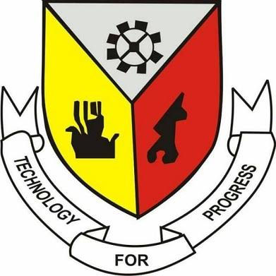

<p align="center">
  
</p>

<h1 align="center">Staff Record Management System (SRMS)</h1>

<p align="center">
  <em>A Case Study of Plateau State Polytechnic</em>
</p>

<p align="center">
  
  
  
  
  
</p>

---

A modern Staff Record Management System built to digitize the management of staff records within **Plateau State Polytechnic**. Secure authentication, role-based access control, staff record management, and an approval workflow for verifying submitted records.

This repository is a working scaffold: the schema, RLS policies, auth flow, role-aware navigation, and every planned page from the MVP are wired up against real Supabase queries. Point it at a Supabase project and it runs.

---

## Table of Contents

- [Tech Stack](#tech-stack)
- [Project Structure](#project-structure)
- [Prerequisites](#prerequisites)
- [Getting Started](#getting-started)
  - [1. Install dependencies](#1-install-dependencies)
  - [2. Create a Supabase project](#2-create-a-supabase-project)
  - [3. Configure environment variables](#3-configure-environment-variables)
  - [4. Run the database migrations](#4-run-the-database-migrations)
  - [5. Create your first administrator](#5-create-your-first-administrator)
  - [6. Run the development server](#6-run-the-development-server)
- [Database & Migrations](#database--migrations)
- [Authentication & Roles](#authentication--roles)
- [Available Scripts](#available-scripts)
- [What's Implemented](#whats-implemented)
- [Next Steps](#next-steps)

---

## Tech Stack

| Category    | Technologies |
|-------------|--------------|
| Framework   | Next.js 16 (App Router), React 19, TypeScript |
| Styling     | Tailwind CSS v4, hand-built shadcn/ui components, Lucide React |
| Backend     | Supabase (Postgres, Auth, Storage, Row Level Security) |
| Forms       | React Hook Form, Zod |
| Data        | TanStack Query, TanStack Table |
| Charts      | Recharts |
| Utilities   | clsx, tailwind-merge, class-variance-authority, date-fns |

> **Note on shadcn/ui:** components were hand-written to match shadcn/ui's output exactly (`src/components/ui/`) rather than pulled via the CLI, since `ui.shadcn.com` wasn't reachable in the scaffolding environment. They behave identically — `npx shadcn@latest add <component>` will still work if you want to add more.

---

## Project Structure

```text
src/
├── app/
│   ├── page.tsx                # Landing page
│   ├── login/                  # Login (public)
│   └── (app)/                  # Authenticated shell (sidebar + topbar)
│       ├── layout.tsx          # Role-aware nav, resolves admin vs staff
│       ├── dashboard/          # Branches by role
│       ├── staff/              # Admin: list, add, view, edit
│       ├── departments/        # Admin: CRUD
│       ├── positions/          # Admin: CRUD
│       ├── approvals/          # Admin: review staff submissions
│       ├── reports/            # Admin: charts (Recharts)
│       ├── profile/            # Staff: own record (read-only)
│       ├── submit/             # Staff: submit new/changed record
│       ├── submissions/        # Staff: track own submission status
│       └── settings/           # Both: account info, sign out
├── components/
│   ├── ui/                     # shadcn/ui primitives
│   ├── layout/                 # Sidebar, topbar, mobile nav
│   ├── shared/                 # PageHeader, EntityFormDialog
│   └── providers/              # TanStack Query provider
├── features/staff/             # Shared staff form (create + edit + self-submit)
├── hooks/                      # TanStack Query hooks per resource
├── services/                   # Supabase query functions per resource
├── schemas/                    # Zod schemas for every form
├── types/                      # database.types.ts + domain types
├── constants/                  # Nav items, labels, badge variants
└── lib/supabase/               # Browser / server / middleware clients
supabase/
├── migrations/                 # Numbered SQL migrations (schema, functions, RLS)
├── seed.sql                    # Sample departments & positions
└── config.toml                 # Local Supabase CLI config
```

---

## Prerequisites

- **Node.js** v20 or later — [Download](https://nodejs.org/)
- **npm** (comes with Node) — pnpm/yarn work too if you prefer
- A free **Supabase** account — [Sign up](https://supabase.com/)
- *(Optional, for local Postgres)* [Supabase CLI](https://supabase.com/docs/guides/cli) + Docker

---

## Getting Started

### 1. Install dependencies

```bash
pnpm install
```

### 2. Create a Supabase project

1. Go to [supabase.com/dashboard](https://supabase.com/dashboard) and create a new project.
2. Under **Project Settings → API**, copy:
   - `Project URL`
   - `anon` `public` key
   - `service_role` key (server-side only — never expose this to the browser)

### 3. Configure environment variables

```bash
cp .env.example .env.local
```

Fill in the three values from step 2:

```env
NEXT_PUBLIC_SUPABASE_URL=https://xxxxx.supabase.co
NEXT_PUBLIC_SUPABASE_ANON_KEY=eyJ...
SUPABASE_SERVICE_ROLE_KEY=eyJ...
```

### 4. Run the database migrations

The schema lives in `supabase/migrations/` as three ordered files:

| File | Contents |
|------|----------|
| `20260731000000_init_schema.sql` | Enums, `departments`, `positions`, `profiles`, `staff`, `staff_submissions` |
| `20260731000001_functions_triggers.sql` | `updated_at` triggers, auto-create-profile-on-signup, `is_admin()`, `approve_staff_submission()` RPC |
| `20260731000002_rls_policies.sql` | Row Level Security for every table |

**Option A — Supabase CLI (recommended):**
https://supabase.com/docs/guides/local-development/cli/getting-started#telemetry 
```bash
npx supabase login
npx supabase link --project-ref <your-project-ref>
npx supabase db push
```

``` pnpm add supabase -D 
pnpm exec supabase --version33333333333333333333333333333333333
   ```

This also applies `supabase/seed.sql` (sample departments & positions) if you run `npx supabase db reset` against a local instance.

**Option B — SQL Editor (no CLI):**

Open the Supabase dashboard → **SQL Editor**, and run the three migration files in order (0000 → 0001 → 0002), then optionally `supabase/seed.sql`.

**Option C — Local Postgres via Docker:**

```bash
npx supabase start   # spins up local Postgres, Studio, Auth on your machine
npx supabase db reset
```

Then point `.env.local` at the local URL/keys printed by `supabase start`.

### 5. Create your first administrator

Every new sign-up gets a `profiles` row with `role = 'staff'` by default (via the `handle_new_user()` trigger). Promote your own account to admin after signing up once through the app:

```sql
update public.profiles set role = 'admin' where email = 'you@example.com';
```

### 6. Run the development server

```bash
npm run dev
```

Visit [http://localhost:3000](http://localhost:3000). Sign up, promote yourself to admin (step 5), then sign back in — you'll land on the admin dashboard.

---

## Database & Migrations

- **Approval workflow:** staff submissions are stored as JSON payloads in `staff_submissions`. Approving one calls the `approve_staff_submission(submission_id, reviewer_id, notes)` Postgres function, which inserts or merges the payload into `staff` and stamps the submission `approved`. Rejecting just updates the submission row — no `staff` mutation.
- **RLS is the source of truth for access control**, not just the UI: admins (`is_admin()`) can read/write everything; staff can read reference data (departments/positions), read/update only their own linked `staff` row, and manage only their own `staff_submissions`.
- **Regenerating types:** `src/types/database.types.ts` is hand-written to mirror the SQL exactly. Once your project is linked, regenerate it for guaranteed accuracy:

  ```bash
  npx supabase gen types typescript --linked > src/types/database.types.ts
  ```

---

## Authentication & Roles

- Auth is handled entirely by Supabase Auth (email/password) via `@supabase/ssr`.
- `src/proxy.ts` (Next.js 16's renamed `middleware.ts`) refreshes the session on every request and redirects unauthenticated users to `/login`.
- `src/hooks/use-current-user.ts` exposes `{ user, profile, isAdmin, isLoading }` on the client; the `(app)` layout uses `isAdmin` to render the admin or staff sidebar/nav automatically — no separate route trees needed.

---

## Available Scripts

| Command | Description |
|---------|-------------|
| `pnpm dev` | Runs the app in development mode (Turbopack) |
| `pnpm  build` | Production build |
| `pnpm start` | Runs the production build |
| `pnpm  lint` | Lints the codebase |

---

## What's Implemented

- ✅ Auth (sign in), session refresh, role-based redirects
- ✅ Admin: staff CRUD, search & filter, departments CRUD, positions CRUD
- ✅ Approval workflow: staff submit → admin approve/reject → `staff` table updates
- ✅ Reports: department headcount bar chart, employment-status pie chart
- ✅ Staff self-service: view own profile, submit new/changed record, track submission status
- ✅ Full RLS-backed security model, not just UI-level role checks

## Next Steps

- Sign-up page (`signUp` service function exists in `src/services/auth.service.ts`; no UI page wired yet — add one under `src/app/signup/` following the login page's pattern)
- Storage bucket + upload flow for staff photos (`photo_url` column is already in the schema)
- Email notifications on submission approval/rejection (see README's original "Future Improvements")
- Bulk import/export, audit logs, MFA — as originally scoped

---

## License

Developed for academic purposes as a case study of **Plateau State Polytechnic**.
